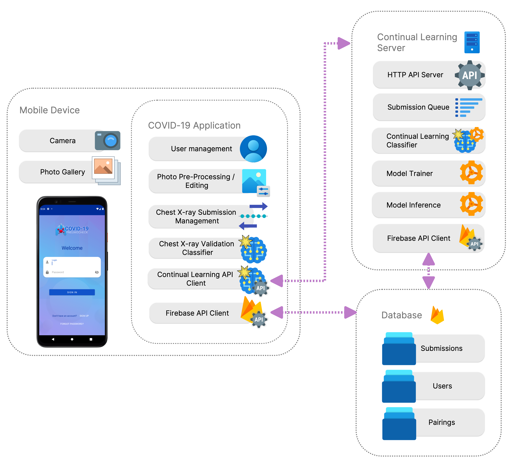
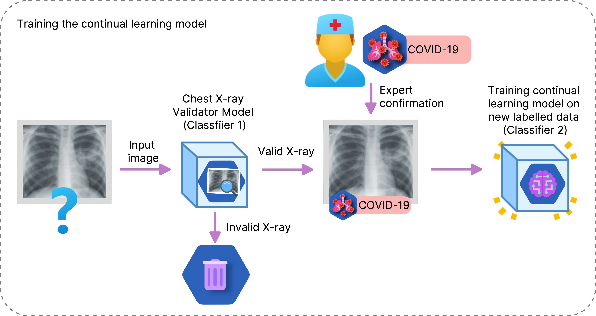
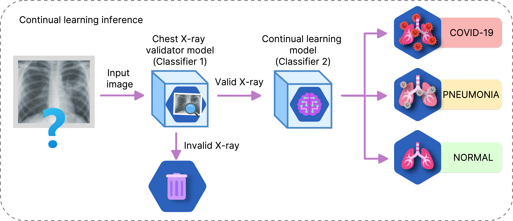
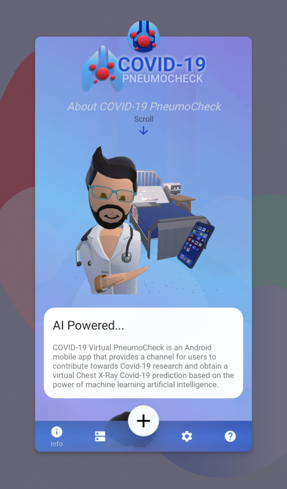
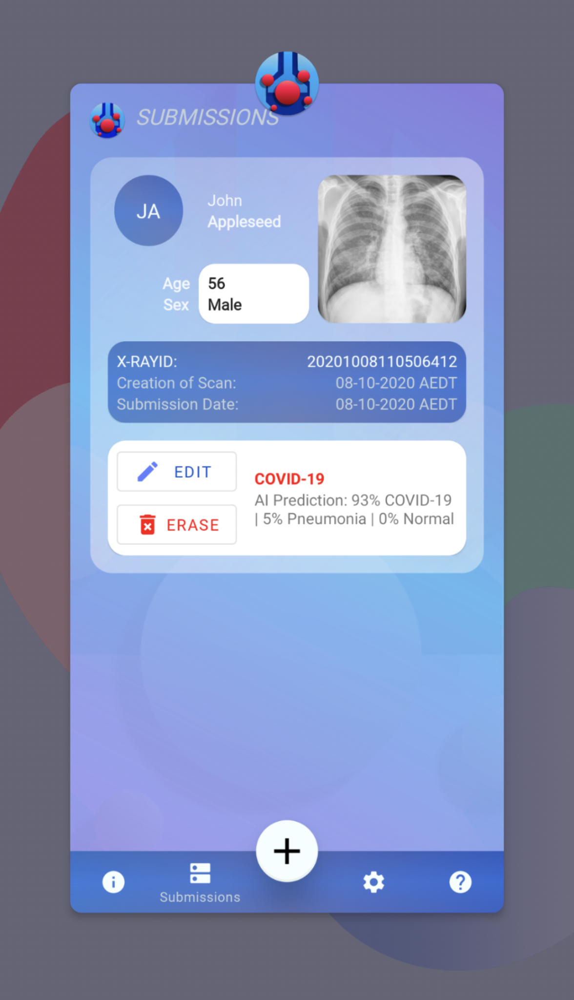
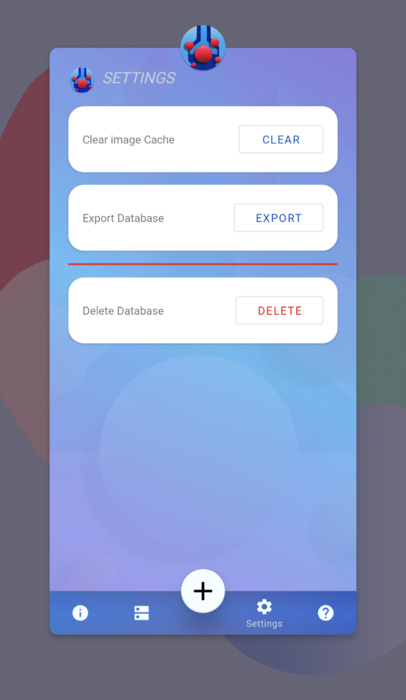
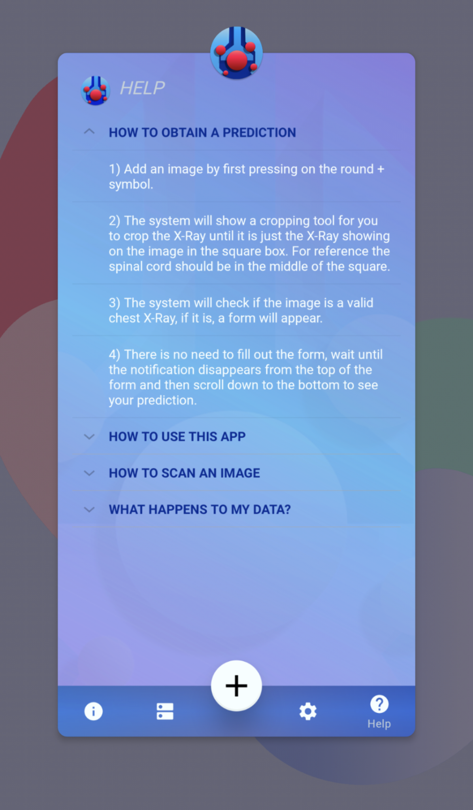

# COVID-19 PneumoCheck - Mobile Chest X-Rays Classifier App

Since the World Health Organization declared COVID-19 a pandemic, efforts have been made to track the mobility and long-term effects of the virus, as well as screen, diagnose, and analyse symptoms. Although RT-PCR has been the gold standard for COVID-19 testing, limited resources for large populations have forced public authorities to pursue alternative methods. Many studies have leveraged artificial intelligence (AI) to predict COVID-19 on medical images. However, the AI system used must be able to adapt as virus strains evolve and different clinical pictures emerge.

Continual learning has shown its adaptive capacity to learn new classes and instances without having to train from scratch. Currently, conventional task sequential machine learning (ML) models are used to train on COVID-19 datasets. However, advances in continual learning have reduced the resources required to retrain a model, and training can be done on demand from a patient’s mobile device.

We have evaluated state-of-the-art continual learning methods for detecting COVID-19 from chest X-ray imaging.
We further used the best performing model to design and implement a novel COVID-19 screening mobile app.

  

We defined a methodology for creating a continual learning model in which we trained a conventional task sequential ML model and used it as the foundation model. Several preprocessing strategies, including cropping, segmentation, and histogram equalisation, were used to train the foundation model. We found that using the original, unmodified chest X-ray gave the best results. We tested both regularisation and memory-based methods, using different memory sizes, for the continual learning. We defined an overall performance measurement matrix that considers both average forgetting and average accuracy to aid in the analysis of the experimental results. The best candidate foundation model was DenseNet161, with 96.87±0.88 accuracy, and the best continual learning method was LwF (Learning without Forgetting), with an overall performance metric result of 71.99%.

  

The mobile application uses a continual-learning DenseNet161 model with Learning without Forgetting (LwF) that is hosted on a cloud server. After a chest X-ray is validated on the device, the image and its metadata are uploaded to the server, where the model performs the full prediction and can incrementally learn from newly submitted, labelled chest X-rays. On the device, the app can run a local/offline foundation model to check that the photo is actually a chest X-ray. The app also provides user and submission management, COVID-19 diagnosis/prediction display, and symptom/survey tracking, while the cloud component is responsible for continual model updates based on confirmed or corrected diagnoses provided later by users/clinicians.

#### Continual Learning Training Process (Initiated by Mobile App)

  

#### Continual Learning Inference Process (Mobile App)

  

## Mobile Application

  

An android application to track and classify COVID-19, Pneumonia or Normal chest X-Rays that implements continual learning to improve the model with doctor confirmed diagnosis.

**WARNING: Regardless of accuracy, do not use this application as a method of self-diagnosis. Please visit a doctor for an official diagnosis.**

  
  
  
  

  

Minimum android version : Android Marshmellow (6)

## Download

If you would like to test and try out the pre-release demo application you may download it from here:
https://github.com/DannyFGitHub/COVID-19PneumoCheckApp/releases

(Remember to allow installation from unknown sources in order for your android system to allow the installation of the app)

Permissions requested by the app at the time of writing include:

- Read and Write Storage - for Chest X-Ray saving and retreiving (to and from app database))
- Camera - for taking pictures of X-Rays.

## Team/Contributors

Danny Falero (PhD Student at Charles Sturt University)

[Professor Ashad Kabir](https://researchoutput.csu.edu.au/en/persons/akabircsueduau) (Project lead and Principal Supervisor)

## FAQ

### How to use this app

This app is intended to help a user track, collect and obtain a pre-diagnostic prediction on the given chest X-Ray.
You may return to the app once obtaining an official diagnosis and either confirm or correct the prediction.
You may choose to export your database and provide it for research purposes to further teach the machine learning model with your corrections or confirmations.

To get started using this app, go to the + symbol and choose a method of uploading your Chest X-Ray photo.
We recommend scanning the X-Ray with a scanner and using the Gallery to prevent any foreign material (glare, sunlight, light anomalies) from impacting the prediction.
Capture or select a photo from gallery, then use the copping tool to crop the image so only the Chest X-Ray is showing entirely within the cropping square tool.
Tap on the checkmark on the top right of the cropping tool screen to confirm the crop.
Once you arrive at the Chest X-Ray submission form, scroll to the bottom and you will see an AI Prediction on the X-Ray you provided.

### How to scan an image

To scan an image, choose the + symbol and tap on Camera.
The PneumoCheck X-Ray identification model will check if the X-Ray provided is a valid Chest X-Ray and begin the Chest X-Ray submission process.
If using the camera, we recommend having your phone in portrait mode aligned to the orientation of your chest x-ray. Both your phone and the chest X-Ray should be as parallel to each other as possible.
For best results we recommend scanning the X-Ray with a flatbed scanner and using the Gallery to prevent any foreign material (glare, sunlight, light anomalies) from impacting the prediction.

### How to obtain a prediction

1. Add an image by first pressing on the round + symbol.

2. The system will show a cropping tool for you to crop the X-Ray until it is just the X-Ray showing on the image in the square box. For reference the spinal cord should be in the middle of the square.

3. The system will check if the image is a valid chest X-Ray, if it is, a form will appear.

4. There is no need to fill out the form, wait until the notification disappears from the top of the form and then scroll down to the bottom to see your prediction.

### What happens to my data

#### X-Ray Image:

When you add a chest X-Ray, the app first runs an offline (on-device) model to check that the image is actually a chest X-Ray. This step does not require internet.
After the image is validated, the X-Ray is uploaded to the PneumoCheck online continual-learning server so it can run the full AI processing and be used (if you allow it) to improve future models. A temporary copy may stay on your device just long enough to finish the upload or the form, but the source of truth is the online server, not your local storage.

#### Submission:

Your submission (the image reference plus any data you enter in the form) is stored in your PneumoCheck cloud record. We do not share your data with anyone unless you explicitly export and provide it for research.

#### Database:

Your data stays in the PneumoCheck cloud (Firebase) while your account/app is active. If you uninstall the app, you may remove local temporary data, but the cloud record remains until it is deleted according to our data-retention rules or you request deletion.

#### Offline / failed upload cases:

If you’re offline or the upload fails, the app may keep the image temporarily on your device and retry the upload later. Once the upload succeeds, the server copy is the one we use.

## If it Keeps saying invalid X-ray provided

The application is pretty good at discriminating between Valid and Invalid X-Rays.
If the application continues to say that the Chest X-Ray provided is not a valid X-Ray, you can try the following:

- Make sure to only take a picture of the Chest X-Ray on a flat surface.
- Make sure that area around the X-Ray is not in the image. (Such as the table the X-Ray may be on or the wall it is mounted on if the X-Ray is in a medical X-ray film viewer)
- Make sure that the X-Ray is not severely dirty, damaged or warped.
- Make sure the X-Ray is FLAT on the surface where it rests.

# Server Status: Offline

For server source code: https://github.com/DannyFGitHub/covid-xray-continual-server

